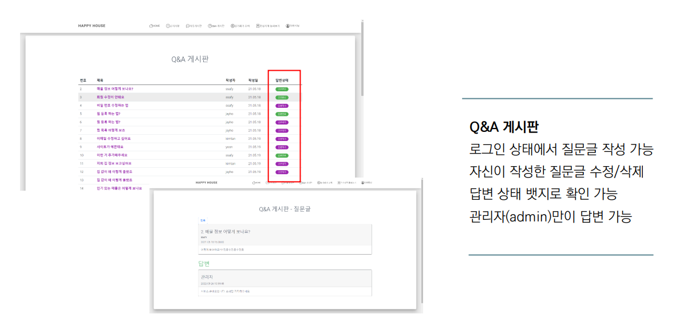

# Happy House 부동산 사이트 프로젝트

## 프로젝트 테스트 방법
1. git clone
```
$ git clone [https://lab.ssafy.com/hithere1012/happyhouse_spring_-_4-_-_.git](https://github.com/Seunghui98/HappyHouse.git)
```
2. 패키지 설치(vue.js)
```
$ npm i
```
3. 실행(vue.js)
```
$ npm run lint
$ npm run serve
```

## 역할 분담
- 이승희(팀장 / Vue.js+spring boot)
    - 로그인 및 로그아웃 (JWT)
    - 유저 기능(회원가입/마이페이지/수정/탈퇴)
    - 카카오맵 연동하여 실거래가 조회
    - Q&A 게시판(CRUD), 자유게시판 댓글기능
    - 찜 기능
    - 뉴스 크롤링
    - 관심매물 워드 클라우드


- 양승호(발표자 / Vue.js+spring boot)
    - 로그인 및 로그아웃 (JWT)
    - 공지사항(CRUD)
    - Q&A 게시판(CRUD)
    - 자유게시판(CRUD)


## 개발 환경


## 시스템 구조도


## ERD


## 화면 설계




